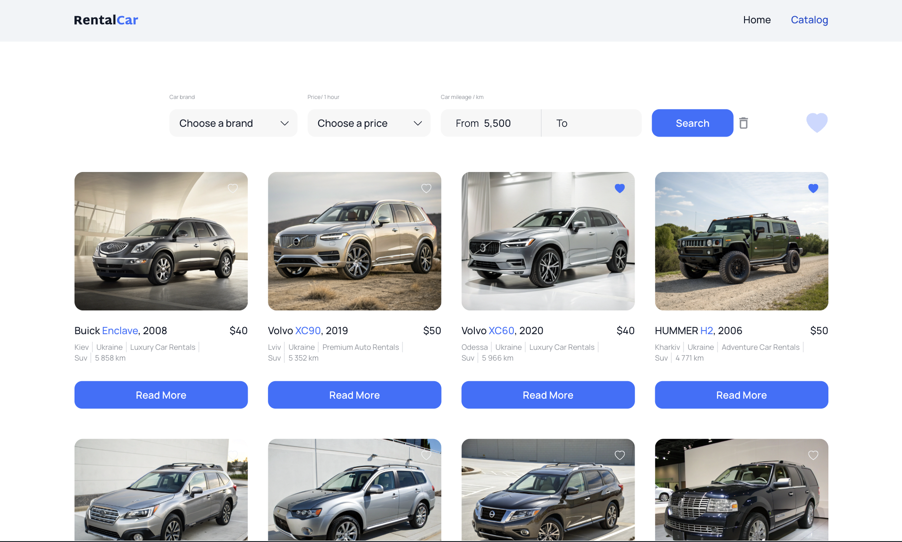
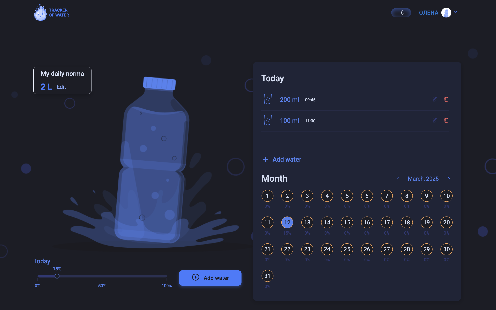
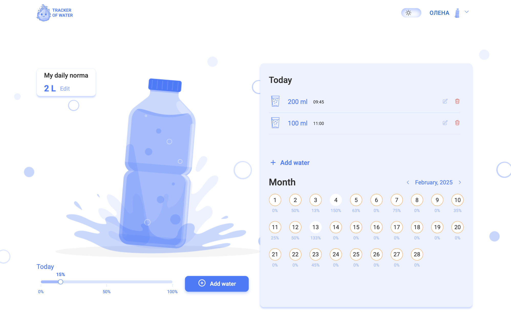
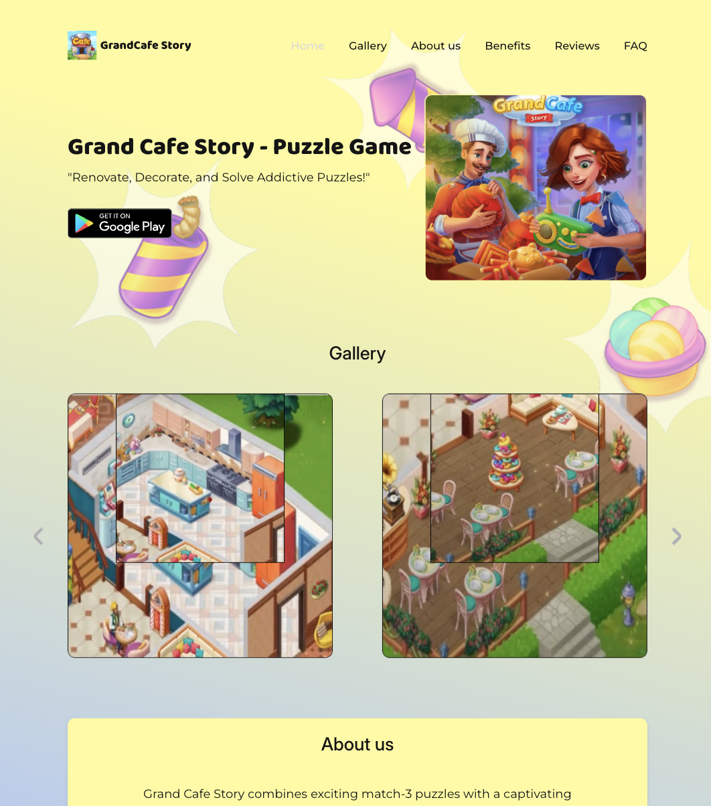
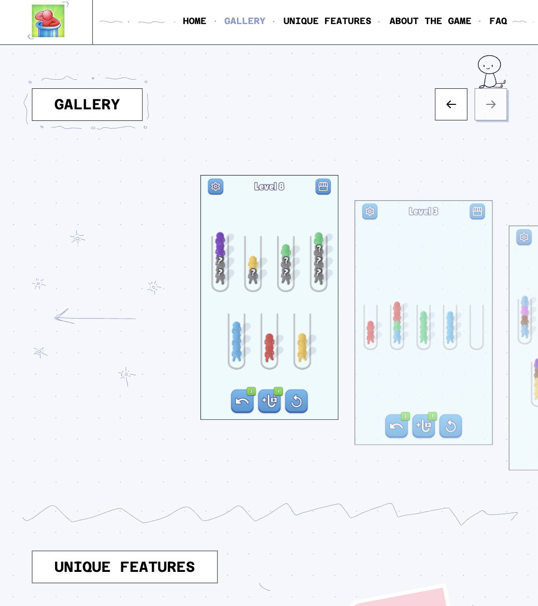
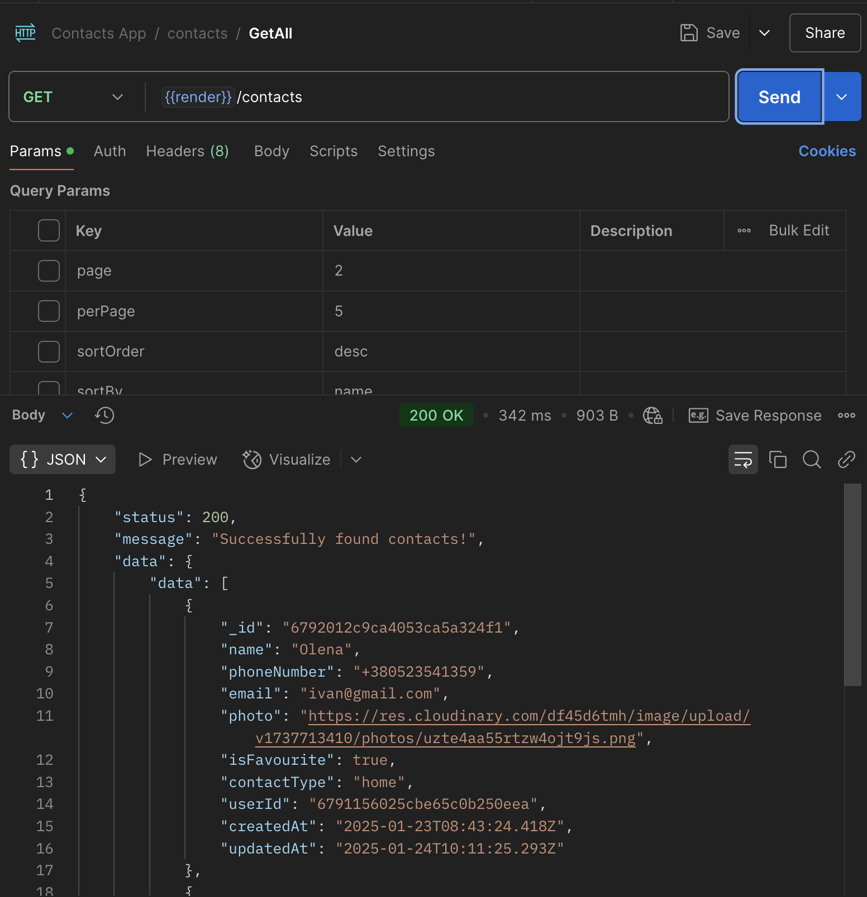
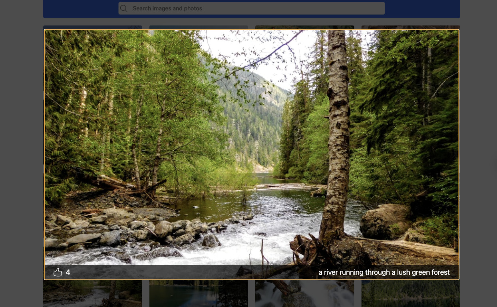
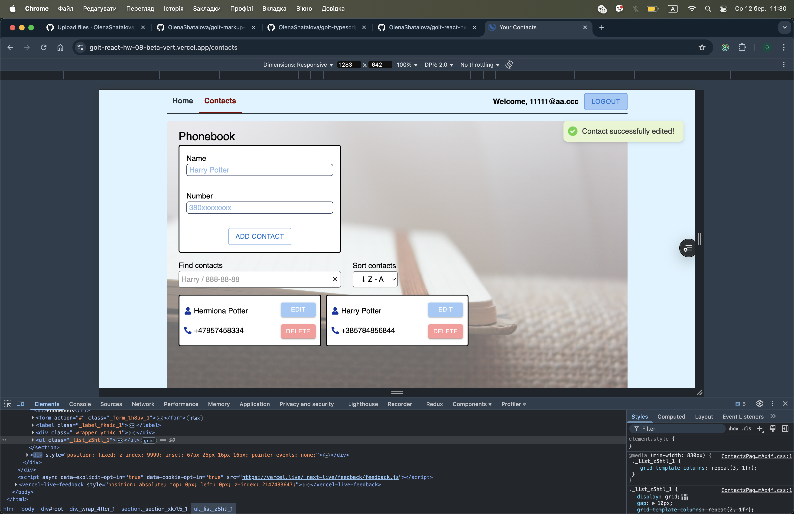
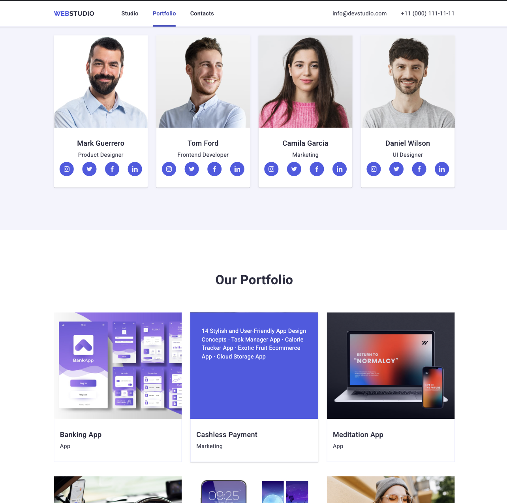

# Мої проєкти

## 🚀 Проєкти

### 🔵 Rental Car

**Опис:**
Самостійний проєкт для оренди автомобілів, виконаний за технічним завданням. Користувачі можуть шукати автомобілі, додавати в обране, переглядати деталі та замовляти через форму.

**Технології:**
Vite, React, Redux, React Router, Redux-Persist, Material UI, Axios, Dayjs.

🔗 [Live Demo](https://rental-car-sepia.vercel.app) 
🔗 [GitHub Repository](https://github.com/OlenaShatalova/rental-car)

---

### 🔵 Water Tracker

  

  

**Опис:**
Командний проєкт для відслідковування споживання води. Має авторизацію, відновлення пароля, користувач може додавати, видаляти та редагувати порції води. Відображає відсоток спожитої води відносно рекомендованої норми за день та статистику за місяц (по днях). Має сервер на Node.js та документацію API.
В проєкті приймала участь розробника та TeamLead-а.

**Технології:**
frontend: Vite, React, Redux, React Router, Material UI, Axios, Formik, Yup, React-Redux, React Toastify, React Modal, React Hot Toast, React Icons, Redux Persist, ESLint.
backend: Node.js, Express, MongoDB (через Mongoose), JWT (jsonwebtoken), Bcrypt, Cloudinary, CORS, dotenv, Swagger (swagger-ui-express, redocly), Nodemailer, Multer, Pino, Joi.

🔗 [Live Demo](https://team-03-water-tracker-frontend.vercel.app) 
🔗 [GitHub Repository: front](https://github.com/OlenaShatalova/team-03-water-tracker-frontend) 
🔗 [GitHub Repository: back](https://github.com/OlenaShatalova/team-03-water-tracker-backend)

---

### 🔵 Grand Cafe Story

**Опис:**
Комерційний проєкт лендингової сторінки. Виконано згідно макету у відповідний термін виконання. В проєкті приймала участь розробника та TeamLead-а.

**Технології:**
Vite, SASS, Swiper.

🔗 [Live Demo](https://olenashatalova.github.io/grand-cafe-story/) 
🔗 [GitHub Repository](https://github.com/OlenaShatalova/grand-cafe-story) 

---

### 🔵 Color Puzzle

**Опис:**
Комерційний проєкт лендингової сторінки. Виконано згідно макету у відповідний термін виконання. В проєкті приймала участь розробника.

**Технології:**
Vite, SASS, Swiper, Animate.css

🔗 [Live Demo](https://yuliia-tyzhai.github.io/color-puzzle/) 
🔗 [GitHub Repository](https://github.com/Yuliia-Tyzhai/color-puzzle)

---

### 🔵 Node.js

**Опис:**
Навчальний проєкт, що реалізує серверну чатсину застосунку з використанням Node.js, MongoDB, CRUD-операцій, авторизації (JWT, Google), валідації, заватнажень зображень та відновлення паролю через email. Для тестування API використовувася Postman. Робота структурована у відповідних гілках.

**Технології:**
Express.js, Mongoose, Swagger, Postman, Mongo Atlas, Mongo DB Compass 

🔗 [GitHub Repository](https://github.com/OlenaShatalova/nodejs-hw-mongodb/tree/main)

---

### 🔵 Search images and photos

**Опис:**
Проєкт пошуку зображень, спочатку реалізований на React і переписаний на TypeScript. Використовується REST API для запитів до сервера по пошуку зображень (https://api.unsplash.com/), лоадер, модальне вікно для перегляду зображень та пагінації для завантаження нових зображень. Адаптований під всі розміри екранів. Проєкт покращує типізацію та організацію коду завдяки TypeScript.

**Технології:**
React, TypeScript, Axios, REST API, React Modal, Normalize, React-DOM, Toaster, Icons, Spinner.

🔗 [Live Demo](https://goit-typescript-hw-02-xi-wine.vercel.app/) 
🔗 [GitHub Repository](https://github.com/OlenaShatalova/goit-typescript-hw-02)

---

### 🔵 React PhoneBook for Tab/Desktop

**Опис:**
Single Page Application для зберігання телефонних контактів. Проєкт дозволяє користувачам реєструватися, авторизуватися та зберігати контакти в особистому профілі, де вони можуть додавати, редагувати і видаляти контакти. Для додавання нових контактів використовується форма на основі бібліотеки Formik. Реалізовано сортування контактів за алфавітом в спадаючому та зростаючому порядку. Зберігається токен через persist для підтримки стану авторизації.

**Технології:**
React, Redux, Redux Thunk, DOM, Material UI, Formik, Persist, Helmet, Toaster, Icons, YUP, NanoID, CLSX.

🔗 [Live Demo](https://goit-react-hw-08-beta-vert.vercel.app/) 
🔗 [GitHub Repository](https://github.com/OlenaShatalova/goit-react-hw-08/tree/main)

---

### 🔵 Web Studio site

**Опис:**
Перший навчальний проєкт, виконаний на HTML, CSS, адаптований під усі розміри екранів за підходом Mobile First. Використано транзішени, базові анімації, оптимізацію та адаптацію зображень для різних розширень і якості. Дизайн виконаний відповідно до макета, реалізована навігація по сторінці. Форма викликається у модальному вікні.

**Технології:**
HTML, CSS, Mobile First, Java Script, Media Queries, Flexbox, ImageOptim, Transitions, <!-- Animations, --> Forms.

🔗 [Live Demo](https://olenashatalova.github.io/goit-markup-hw-06/index.html) 
🔗 [GitHub Repository](https://github.com/OlenaShatalova/goit-markup-hw-06)

---
Портфоліо ще в процесі наповнення – не всі проєкти додані, проте їх можна переглянути в моїх репозиторіях на GitHub

## 📫 Контакти  
- [LinkedIn](www.linkedin.com/in/olena-shatalova)  
- [GitHub](https://github.com/OlenaShatalova)
- 📱 [Phone](+380673000888)  
- 💬 [Telegram](https://t.me/matsailol)
